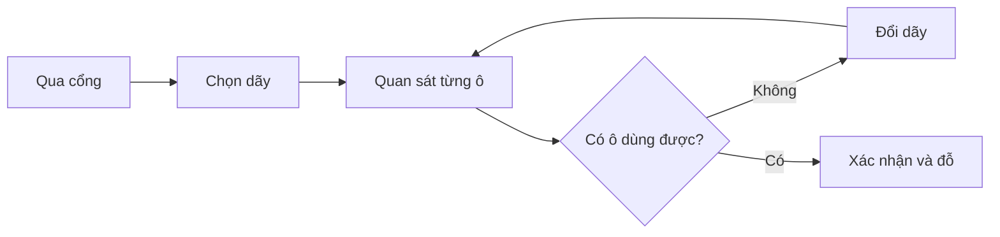
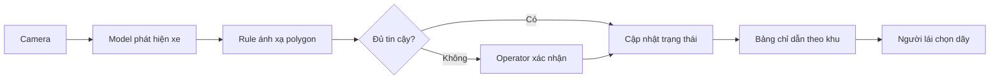

# 01 — Individual Problem Scan

> Bản nháp dựa trên bối cảnh camera phát hiện chỗ đỗ xe trống. “Dấu hiệu thật” là tín hiệu cần thu trong thực địa, chưa phải dữ liệu đã có.

**Phân biệt hai yêu cầu:** phần scan dưới đây có **10 problems** (vượt mức tối thiểu 5). Sau đó tôi chọn **top 3** trong 10 problems để viết 3 Problem Cards chi tiết; vì vậy 3 cards không có nghĩa là bài chỉ có 3 problems.

## Scan rộng — 10 problems

| # | Lăng kính | Problem quan sát được | Ai chịu ảnh hưởng? | Dấu hiệu thật cần thu |
|---:|---|---|---|---|
| 1 | Tốn thời gian | Phải chạy vòng để tìm ô trống | Người lái | Thời gian cổng→đỗ; số dãy đi qua |
| 2 | Pain từ người khác | Bảo vệ bị hỏi chỗ trống nhưng không biết trạng thái toàn bãi | Bảo vệ, người lái | Số câu hỏi/ca; phút kiểm tra |
| 3 | Lặp lại | Nhân viên tuần tra và đếm ô trống bằng mắt | Nhân viên vận hành | Lượt/ngày; phút/lượt; sai lệch |
| 4 | AI có thể tốt hơn | Camera chỉ dùng xem lại, chưa tạo trạng thái ô | Quản lý bãi | Camera phù hợp; tỷ lệ ô nhìn rõ |
| 5 | Tốn thời gian | Đi vào dãy đầy rồi phải quay ra | Người lái | Số lần quay đầu; thời gian ùn |
| 6 | Pain từ người khác | Người lái không nhớ khu vực đã đỗ nên khó tìm lại xe | Người lái, bảo vệ | Phút tìm xe; số khu đã đi qua; lượt nhờ hỗ trợ/ca |
| 7 | Lặp lại | Biển còn chỗ được cập nhật thủ công và chậm | Vận hành | Độ trễ; số lần biển sai |
| 8 | Sai sót | Xe lấn vạch làm ô không dùng được nhưng bộ đếm cổng vẫn coi còn chỗ | Người lái, quản lý | Case lấn vạch; chênh lệch đếm |
| 9 | Ngoại lệ | Mưa, bóng đổ, xe lớn, vật cản làm khó xác định trạng thái | Vận hành | Lỗi theo thời tiết/giờ/loại xe |
| 10 | Tiếp cận | Khó biết ô ưu tiên còn trống trước khi đi sâu vào bãi | Người cần ô ưu tiên | Thời gian tìm; chuyến đi vô ích |

## Top 3

| Rank | Problem | Vì sao chọn | Điều còn chưa chắc |
|---:|---|---|---|
| 1 | Tìm ô trống trong bãi | Actor/workflow rõ, đo được thời gian, camera có điểm can thiệp cụ thể | Baseline, góc camera, đêm/mưa |
| 2 | Cập nhật biển còn chỗ chậm | Handoff rõ; tác động trực tiếp đến luồng xe | Bãi đang dùng biển hay bộ đếm nào |
| 3 | Khó tìm lại xe khi quên khu vực đỗ | Pain rõ với người lái trong bãi lớn; workflow tìm kiếm có thể quan sát và đo thời gian | Tần suất xảy ra và mức người dùng chấp nhận cung cấp thông tin xe |

## Problem Card #1 — Tìm ô đỗ trống

**Problem 1 câu:** Người lái vào bãi không biết ô nào đang trống nên phải quan sát từng dãy và có thể chạy vòng trước khi đỗ.

**Actor:** Người lái không quen bãi; secondary actor là nhân viên vận hành.

**Bối cảnh:** Sau khi qua cổng, nhất là giờ cao điểm tại bãi nhiều dãy và tầm nhìn bị che.

**Current workflow:** Vào bãi → nhìn biển/hỏi bảo vệ → chọn dãy → nhìn từng ô → nếu đầy thì đổi dãy → tiếp cận xác nhận → đỗ.

**Bottleneck:** Việc khám phá trạng thái tuần tự ở từng dãy gây quay đầu và tìm kiếm lâu.

**Impact:** Tăng thời gian, quãng đường trong bãi và nguy cơ ùn. Baseline chưa có; pilot đo median và P90.

**Success metric:** So với baseline cùng khung giờ, giảm median thời gian cổng→đỗ ≥30%; P90 không tăng; accuracy trạng thái ≥95%; tỷ lệ không báo trống sai ≥98%.

**Non-AI alternative:** Biển tốt hơn, bảo vệ điều phối, cảm biến từng ô, hoặc bộ đếm xe theo khu.

**AI hypothesis:** Camera cố định + computer vision phát hiện xe trong polygon từng ô; case không chắc chuyển cho operator.

**Quick gut:** **Workflow**, không cần Agent tự lập kế hoạch.





**Fallback:** Camera/model lỗi → ẩn dữ liệu cũ, hiển thị “vui lòng quan sát”, chuyển về điều phối thủ công.

## Problem Card #2 — Biển còn chỗ cập nhật chậm

**Problem 1 câu:** Không có trạng thái theo ô gần thời gian thực nên biển hướng dẫn có thể sai hoặc chậm.

**Actor:** Nhân viên vận hành. **Bối cảnh:** Xe vào/ra trong giờ đông.

**Current workflow:** Quan sát/tuần tra → ước lượng → báo bộ đàm → cập nhật biển.

**Bottleneck:** Tổng hợp thủ công từ nhiều khu. **Impact:** Xe bị hướng vào khu đầy; nhân viên sửa thông tin nhiều lần.

**Metric:** 95% thay đổi phản ánh trong ≤10 giây; tỷ lệ chỉ sai khu còn chỗ <2%.

**Non-AI:** Nút bấm, bộ đếm cổng. **AI hypothesis:** Camera → model → smoothing → biển; ngoại lệ qua operator. **Quick gut:** Workflow.

```text
CURRENT: Quan sát/tuần tra → ước lượng → bộ đàm → cập nhật biển
FUTURE: Camera → detect → ổn định trạng thái → biển
                     ↘ không chắc → operator
Fallback: nút bấm thủ công.
```

## Problem Card #3 — Khó tìm lại xe khi quên khu vực đỗ

**Problem 1 câu:** Sau khi quay lại bãi xe, người lái không nhớ khu vực hoặc tầng đã đỗ nên phải đi qua nhiều dãy để tìm xe.

**Actor:** Người lái xe tại bãi nhiều tầng hoặc có nhiều khu giống nhau, đặc biệt là khách lần đầu đến.

**Bối cảnh:** Khi người lái quay lại lấy xe sau vài giờ và không nhớ mã khu, tầng hoặc số ô.

**Current workflow:** Rời tòa nhà → cố nhớ lối đã đi → đến khu vực phỏng đoán → quan sát từng dãy → bấm chìa khóa/còi xe → nếu không thấy thì đổi tầng hoặc hỏi bảo vệ → tìm thấy xe.

**Bottleneck:** Người lái không có mốc vị trí đã lưu nên phải tìm kiếm thử–sai qua nhiều dãy hoặc tầng.

**Impact:** Mất thời gian, phải đi bộ xa và gây lo lắng; bảo vệ cũng mất thời gian hỗ trợ. Baseline cần đo bằng số phút tìm xe, số khu đã đi qua và số yêu cầu hỗ trợ mỗi ca.

**Success metric:** Giảm median thời gian từ lúc vào bãi để lấy xe đến khi tìm thấy xe ít nhất 50%; ít nhất 90% truy vấn hợp lệ trả về đúng khu/tầng; không cung cấp vị trí xe nếu người dùng không chứng minh được quyền truy vấn.

**Non-AI alternative:** Biển/màu khu vực rõ hơn, số ô dễ nhớ, vé ghi vị trí, QR tại ô để người dùng tự lưu vị trí hoặc nút “Save parking” trên điện thoại.

**AI hypothesis:** Camera có thể ghi nhận sự kiện một xe dừng tại ô và liên kết vị trí với mã phiên/vé do người dùng chủ động cung cấp. Khi truy vấn, workflow trả về khu/tầng sau bước xác thực; không dùng nhận diện khuôn mặt.

**Quick gut:** **Workflow**, nhưng chỉ nên thử sau khi phương án QR/lưu vị trí thủ công được chứng minh là chưa đủ.

```text
CURRENT:
[Quay lại bãi] → [Cố nhớ khu/tầng] → [Tìm từng dãy] → [Bấm chìa khóa]
→ [Đổi khu/tầng hoặc hỏi bảo vệ] → [Tìm thấy xe]

FUTURE:
[Xe vào ô] → [Camera phát hiện sự kiện đỗ] → [Rule lưu khu/tầng theo mã phiên]
→ [Người dùng xác thực mã vé/phiên] → [Hệ thống chỉ dẫn khu vực] → [Tìm thấy xe]

Human boundary: bảo vệ chỉ hỗ trợ khi xác thực tự động không đủ; không tiết lộ vị trí chỉ từ mô tả xe.
Fallback: không tìm thấy bản ghi hoặc xác thực thất bại → không trả vị trí, chuyển sang quy trình hỗ trợ thủ công.
```

## Card muốn pitch nhất

**Card:** #1. Pain nằm ngay trong hành trình chính, đo được và thử trong 20–30 ô mà không tự động hóa quyết định rủi ro cao.

**Lời pitch cá nhân:** Người lái, đặc biệt là người không quen bãi, hiện chỉ biết một ô có trống hay không khi đã đi đến gần. Nếu dãy đã đầy, họ phải quay đầu và tiếp tục tìm, làm tăng thời gian và luồng xe trong bãi. Tôi đề xuất kiểm chứng một workflow camera trên 20–30 ô: AI chỉ phát hiện xe, rule xác định trạng thái ô, còn operator xử lý trường hợp không chắc chắn. Thành công được đo bằng thời gian cổng–đến–ô, tỷ lệ báo trống đúng và độ trễ cập nhật, chứ không chỉ bằng độ chính xác mô hình.

**Câu hỏi challenge:** Nếu biển theo khu + bộ đếm cổng giải được 80% pain, camera theo từng ô có đáng với chi phí và rủi ro riêng tư không?

**Ý kiến cá nhân sau phản biện:** Tôi giữ camera như một phương án pilot, không mặc định là giải pháp cuối. Tôi bổ sung cảm biến và bộ đếm cổng làm baseline, thu hẹp phạm vi khỏi nhận diện biển số/khuôn mặt, và thêm trạng thái `không chắc chắn` thay vì ép mô hình luôn trả lời trống hoặc có xe.

## Điểm yếu cần kiểm chứng

- Chưa có baseline thật; không được tuyên bố tiết kiệm phút cụ thể.
- Accuracy chung chưa đủ; lỗi “báo trống giả” cần metric riêng.
- Nếu camera không nhìn rõ từng ô, cảm biến hoặc đếm theo khu có thể tốt hơn.

## Self-check phần cá nhân

- [x] Scan 10 problems, mỗi problem có actor và tín hiệu cần đo.
- [x] Dùng nhiều hơn 3 lăng kính quan sát.
- [x] Chọn top 3 và viết đủ actor, workflow, bottleneck, impact, metric, non-AI, AI hypothesis.
- [x] Cả 3 cards có workflow trước/sau và fallback.
- [x] Có card pitch, lời pitch, câu hỏi challenge và thay đổi sau phản biện.
