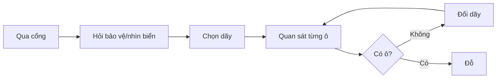
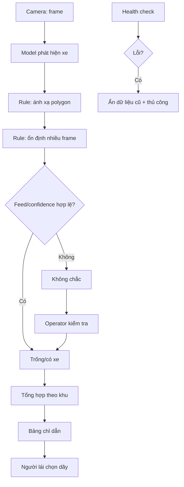

# 02 — Group Problem Statement

> Bản thống nhất của nhóm về bài toán camera phát hiện chỗ đỗ xe trống. Số liệu chưa được đo thực địa được ghi rõ là mục tiêu pilot, không trình bày như kết quả đã đạt.

## Thành viên và vai trò

Nhóm thống nhất phân công theo bốn vai trò: điều phối thảo luận, mô tả workflow, research/validation và tổng hợp tài liệu. Tên và mã học viên chưa được cung cấp nên không tự tạo thông tin định danh; mỗi thành viên bổ sung khi nộp repo của mình.

## Group convergence

### Nhật ký trình bày 9 candidates

| # | Candidate problem | Người gặp vấn đề | Điểm nghẽn | Nhận định của nhóm |
|---:|---|---|---|---|
| 1 | Người lái tìm ô trống | Người lái | Chỉ thấy trạng thái khi đến gần | Giữ để shortlist |
| 2 | Biển còn chỗ cập nhật chậm | Người lái, vận hành | Tổng hợp/cập nhật thủ công | Giữ để shortlist |
| 3 | Khó tìm lại xe khi quên khu vực đỗ | Người lái | Không có mốc vị trí đã lưu | Giữ để shortlist |
| 4 | Xe đi vào dãy đã đầy | Người lái | Thiếu hướng dẫn theo khu | Gom với candidate 1 |
| 5 | Bảo vệ trả lời câu hỏi lặp lại | Bảo vệ | Không có trạng thái toàn bãi | Gom với candidate 2 |
| 6 | Phát hiện xe đỗ lấn vạch | Vận hành | Đếm xe không phản ánh ô dùng được | Ngoài scope pilot đầu |
| 7 | Theo dõi giờ cao điểm | Quản lý | Thiếu lịch sử theo thời gian | Xem là lợi ích dữ liệu phụ, không shortlist |
| 8 | Tìm ô ưu tiên | Người cần ô ưu tiên | Không biết trạng thái trước khi vào sâu | Giá trị cao nhưng cần boundary riêng |
| 9 | Camera sai khi mưa/tối | Vận hành | Chất lượng ảnh thay đổi | Là rủi ro/validation, không phải candidate chính |

| Cluster | Candidates | Pattern chung |
|---|---|---|
| Tìm và điều hướng | Tìm ô trống; tránh dãy đầy | Người lái thiếu thông tin đúng lúc |
| Quan sát vận hành | Cập nhật biển; trả lời người lái; phát hiện ô không dùng được | Nhân viên tổng hợp bằng mắt |
| Tìm lại phương tiện | Quên khu/tầng; hỏi bảo vệ tìm xe | Người lái thiếu mốc vị trí đã đỗ |

### Shortlist và score nháp

| Candidate | Vì sao vào shortlist | Rủi ro / điều chưa rõ |
|---|---|---|
| Người lái tìm ô trống | Actor trực tiếp; workflow có vòng lặp; outcome đo bằng thời gian | Baseline và mức độ pain tại bãi mục tiêu chưa đo |
| Biển cập nhật chậm | Handoff vận hành rõ; độ trễ đo được | Chưa biết thiết bị/quy trình hiện hữu |
| Khó tìm lại xe | Pain trực tiếp, workflow tìm thử–sai đo được | Có rủi ro tiết lộ vị trí xe; QR lưu vị trí có thể đã đủ |

| Candidate | Actor | Workflow | Evidence | Impact | Làm trong lab | So sánh R/W/A | Hiểu domain | Tổng /35 |
|---|---:|---:|---:|---:|---:|---:|---:|---:|
| Người lái tìm ô trống | 5 | 5 | 2 | 5 | 5 | 5 | 4 | 31 |
| Biển cập nhật chậm | 4 | 4 | 2 | 4 | 5 | 5 | 3 | 27 |
| Khó tìm lại xe | 5 | 4 | 2 | 4 | 4 | 5 | 3 | 27 |

Evidence cố ý chấm thấp vì chưa có interview/log. Nhóm phải điều chỉnh sau kiểm chứng.

**Candidate chọn:** Giảm việc người lái chạy vòng tìm ô trong một khu có camera cố định.

**Vì sao:** Workflow rõ nhất, metric hành vi đo được, pilot giới hạn 20–30 ô. Bài cập nhật biển là lợi ích phụ; bài tìm lại xe cần cơ chế xác thực và boundary riêng nên chưa chọn cho pilot đầu.

**Vì sao chưa chọn bài khác:** Biển cập nhật chậm phụ thuộc hệ thống hiện tại chưa rõ. Tìm lại xe có pain rõ nhưng QR “lưu vị trí” có thể giải đơn giản hơn, đồng thời việc trả vị trí xe tạo rủi ro riêng tư và an ninh nếu xác thực không chặt.

**Disagreement và cách xử lý:** Nhóm cân nhắc hai hướng: camera theo từng ô hoặc bộ đếm cổng/biển theo khu. Nhóm không chọn theo độ “AI” mà thống nhất thử camera ở scope nhỏ, đồng thời giữ bộ đếm/cảm biến làm baseline. Nếu camera không vượt baseline về độ tin cậy và tổng chi phí thì hạ xuống Rule.

## Quick validation

Phỏng vấn 3 người lái và 2 nhân viên tại bãi mục tiêu; quan sát 30 lượt đỗ ở hai khung giờ. Hỏi về lần gần nhất, không hỏi “có thích AI không”.

| Nguồn | Mẫu mục tiêu | Xác nhận cần tìm | Tín hiệu phản bác | Cách sửa problem |
|---|---:|---|---|---|
| Interview người lái | 3 | Đi qua ≥2 dãy hoặc mất thời gian tìm | Hầu hết thấy ô ngay | Chỉ tập trung giờ cao điểm/hạ ưu tiên |
| Interview vận hành | 2 | Bị hỏi thường xuyên; khó biết toàn khu | Thiết bị hiện tại đã đủ | Tích hợp hoặc No-Go |
| Quan sát cổng→ô | 30 lượt | Median/P90 và số lần quay đầu đáng kể | Pain hiếm | Chọn signage/rule đơn giản |
| Ground-truth ảnh | ≥500 frame | Polygon ô nhìn rõ | Nhiều che khuất/mưa/tối | Đổi góc, giảm scope hoặc dùng sensor |

### Kết quả kiểm chứng hiện có

| Nguồn | Phạm vi | Tín hiệu xác nhận | Tín hiệu phản bác | Nhóm sửa gì |
|---|---:|---|---|---|
| Desk research | 3 nguồn kỹ thuật/dataset | Occupancy từ camera có workflow và benchmark công khai | Benchmark không chứng minh hiệu quả tại bãi mục tiêu | Không dùng accuracy nguồn ngoài làm kết quả của nhóm |
| Review workflow | 9 candidates, 3 clusters | Điểm nghẽn chung là thiếu trạng thái kịp thời | Một phần pain có thể giải bằng biển/bộ đếm | Bắt buộc so sánh non-AI/Rule trong pilot |
| Dữ liệu thực địa | Chưa thu | Chưa có bằng chứng định lượng tại bãi mục tiêu | Baseline, coverage và domain shift chưa biết | Chỉ Go pilot/shadow mode, chưa Go production |

**Insight sau validation:** Pain không phải “bãi xe cần AI”, mà là người lái thiếu trạng thái chỗ đỗ đúng lúc. Camera chỉ đáng chọn nếu số đo tại bãi mục tiêu cho thấy trạng thái đủ chính xác và giảm thời gian tìm tốt hơn phương án đơn giản.

## Research giải pháp

| Nguồn / pattern | Link | Giải quyết gì? | Điểm mạnh | Khoảng trống/rủi ro | Bài học |
|---|---|---|---|---|---|
| Ultralytics Parking Management | [Docs](https://docs.ultralytics.com/guides/parking-management/) | Detector + polygon để tính occupied/available | Workflow mẫu, công cụ đánh vùng | Không chứng minh accuracy tại bãi mục tiêu; cần kiểm license | Dựng baseline nhanh, phải test local data |
| PKLot | [Dataset](https://web.inf.ufpr.br/vri/databases/parking-lot-database/) | Ảnh từng ô ở nhiều thời tiết | Benchmark occupancy | Domain shift về góc, xe, ánh sáng | Không thay dữ liệu pilot |
| CNRPark+EXT | [Dataset](http://cnrpark.it/) | Ảnh bãi xe nhiều điều kiện | Kiểm tính tổng quát | Layout khác; cần kiểm quyền dùng | Đo theo từng điều kiện |
| Cảm biến từng ô | Non-AI | Hiện diện tại mỗi ô | Ít rủi ro hình ảnh | Chi phí lắp/bảo trì theo ô | Baseline tổng chi phí bắt buộc |
| Bộ đếm cổng | Rule | Suy ra sức chứa theo xe vào/ra | Đơn giản, dễ giải thích | Drift; không biết ô thực dùng được | Có thể đủ nếu chỉ cần trạng thái theo khu |

**Takeaway:** Pattern kỹ thuật đã tồn tại nhưng không chứng minh phù hợp với camera cụ thể. Phải đo domain shift, occlusion và báo trống giả. [NIST AI RMF Core](https://airc.nist.gov/airmf-resources/airmf/5-sec-core/) nhấn mạnh vai trò, trách nhiệm và human oversight; vì vậy operator sở hữu ngoại lệ và trạng thái công bố.

## Workflow before/after

| Bước | Actor | Input | Output | Tần suất | Ghi chú |
|---:|---|---|---|---|---|
| 1 | Người lái | Lối vào | Xe vào bãi | Mỗi lượt | Bắt đầu timestamp |
| 2 | Người lái/bảo vệ | Biển/quan sát | Chọn dãy | Mỗi lượt | Có thể cũ/thiếu |
| 3 | Người lái | Tầm nhìn | Đánh giá ô | Lặp theo dãy | Bottleneck |
| 4 | Người lái | Dãy đầy | Chuyển dãy | Có thể lặp | Gây quay đầu |
| 5 | Người lái | Ô khả dụng | Đỗ xong | Mỗi lượt | Kết thúc timestamp |

**Bottleneck:** Trạng thái ô chỉ được khám phá tuần tự khi đến gần.

| Metric | Trước | Sau kỳ vọng | Cách đo |
|---|---:|---:|---|
| Số bước người lái | 5 + vòng lặp | 4, ít vòng lặp | Quan sát hành trình |
| Median cổng→đỗ | Cần đo | Giảm ≥30% | Timestamp, cùng khung giờ |
| P90 cổng→đỗ | Cần đo | Không tăng | Timestamp |
| Accuracy trạng thái | Chưa có | ≥95% | Nhãn người kiểm tra |
| Không báo trống sai | Chưa đo | ≥98% | Ground truth |
| Độ trễ | Thủ công/chưa đo | 95% ≤10 giây | Event→màn hình |
| Risk mới | Thông tin chậm | AI sai, feed chết, privacy | Log/incident |

## Problem Statement v0

| Field | Nội dung |
|---|---|
| **Actor** | Người lái trong bãi nhiều dãy; vận hành là actor hỗ trợ. |
| **Workflow** | Qua cổng → chọn dãy → nhìn từng ô → đổi dãy nếu đầy → xác nhận → đỗ. |
| **Bottleneck** | Chỉ biết trạng thái khi đến gần, dẫn đến tìm tuần tự/quay đầu. |
| **Impact** | Tăng thời gian và quãng đường; magnitude chưa có baseline. |
| **Success Metric** | Median giảm ≥30%; P90 không tăng; accuracy ≥95%; không báo trống sai ≥98%; 95% update ≤10 giây. |
| **Boundary** | 20–30 ô, một camera, ban ngày; không nhận diện người/biển số, đặt chỗ, thu phí, xử phạt hoặc barrier. |

## Rule / Workflow / Agent

**Ma trận:** độ mơ hồ thấp, độ phức tạp trung bình/cao. Output có ba trạng thái định trước; chuỗi camera→model→rule→review→hiển thị có nhiều bước nhưng không cần tự lập kế hoạch.

| Mức | Phương án | Khi nào đủ | Rủi ro/hạn chế | Chọn? |
|---|---|---|---|---|
| No AI | Biển/vạch tốt hơn, bảo vệ | Bãi nhỏ, pain do signage | Không có trạng thái động | Baseline rẻ nhất |
| Rule | Đếm cổng hoặc sensor từng ô | Camera kém, sensor hợp chi phí | Đếm drift; chi phí mỗi ô | Phương án thay thế |
| Workflow | Camera→detection→rule→review→biển | Camera rõ và đạt gate | Domain shift, privacy, integration | **Pilot** |
| Agent | Tự chọn tool/xử lý/điều khiển | Chỉ khi phi tuyến và tự chủ có giá trị | Quyền rộng, khó audit | Không chọn |

Rule không đủ cho ảnh biến thiên; nhưng nếu sensor/bộ đếm đáng tin và rẻ hơn thì phải hạ xuống Rule. Agent không cần vì đường đi và ngoại lệ đều định trước.

### Năm câu hỏi chốt

1. **Rule có giải được 70–80% case không?** Có thể, nếu mục tiêu chỉ là báo khu còn chỗ bằng bộ đếm cổng. Rule chưa biết chính xác ô nào dùng được trong các trường hợp xe lấn vạch hoặc phân khu không đồng bộ.
2. **Workflow thẳng hay phải rẽ nhánh?** Phần lớn đi theo chuỗi cố định; chỉ rẽ sang operator khi confidence thấp, feed lỗi hoặc trạng thái quá cũ.
3. **Có cần Agent tự lập kế hoạch/gọi tool không?** Không. Input, output, thứ tự bước và cách xử lý ngoại lệ đều xác định trước.
4. **Nếu AI sai, ai phát hiện và sửa?** Health check phát hiện lỗi feed; operator xem hàng đợi `không chắc chắn`, đối chiếu camera và sửa trạng thái trước khi công bố.
5. **Có hạ mức được không?** Có. Nếu camera không đạt quality gate hoặc thua tổng chi phí, nhóm chuyển sang bộ đếm cổng, cảm biến hoặc biển/bảo vệ thủ công.

## Problem Statement v1

| Field | Nội dung |
|---|---|
| **Actor** | Người lái tại khu pilot; operator chịu trách nhiệm trạng thái hiển thị. |
| **Workflow** | Camera → detect → polygon/smoothing → operator xử lý ngoại lệ → tổng hợp khu → biển → chọn dãy. |
| **Bottleneck** | Current state khám phá trạng thái tuần tự khi tới gần. |
| **Impact** | Tăng thời gian/vòng lặp; baseline đo trước pilot. |
| **Success Metric** | Median giảm ≥30%; P90 không tăng; accuracy ≥95%; không báo trống sai ≥98%; 95% update ≤10 giây; feed uptime ≥99%. |
| **Boundary** | 20–30 ô, một camera, ban ngày; chỉ xác định trạng thái ô; không biometric/biển số, xử phạt, đặt chỗ, thanh toán, barrier. |
| **AI intervention point** | Nhận diện xe từ frame; polygon, smoothing, health check và routing là rule/workflow. |
| **Mức chọn** | Workflow |
| **Rủi ro & người kiểm tra** | Báo trống sai, che khuất, ánh sáng, mất feed, privacy. Operator kiểm tra `không chắc`; ops owner duyệt mở rộng. |

## Final decision

| Câu hỏi | Trả lời | Ghi chú |
|---|---|---|
| Actor/workflow rõ? | Yes | Cần gắn bãi cụ thể |
| Baseline/metric đã đo? | Not Yet | Có định nghĩa, chưa thu |
| Data đủ? | Not Yet | Cần ≥500 frame và 30 hành trình |
| Hậu quả lỗi chấp nhận được? | Yes có điều kiện | Không điều khiển/xử phạt; có `không chắc` |
| Có owner? | Not Yet | Chỉ định trước pilot |
| Có non-AI đơn giản hơn? | Yes | So signage, đếm cổng, sensor |

**Decision: Go có điều kiện với pilot nhỏ; chưa Go production.**

### Pilot và rollback

1. Chọn 20–30 ô nhìn rõ; vẽ polygon.
2. Thu ≥500 frame đa điều kiện và 30 hành trình; hạn chế dữ liệu định danh.
3. Hai người gán ground truth cho một mẫu và xử lý bất đồng.
4. Chạy offline, rồi shadow mode một tuần cho operator.
5. Chỉ hiển thị cho người lái nếu đạt accuracy ≥95%, không báo trống sai ≥98%, 95% update ≤10 giây, uptime ≥99%.
6. A/B theo khung giờ tương đương; mở rộng khi median giảm ≥30%, P90 không xấu và workload ngoại lệ chấp nhận được.

**Rollback:** Confidence/feed lỗi → `không chắc`; dữ liệu cũ >30 giây, tỷ lệ báo trống đúng dưới gate hoặc hai lỗi camera liên tiếp → ẩn chỉ dẫn, dùng biển/bảo vệ thủ công.

## Công việc tiếp theo sau bản phân tích

- Bổ sung tên/mã học viên vào repo cá nhân; không tự tạo dữ liệu định danh.
- Thực hiện interview, quan sát, ground truth và đo baseline tại bãi mục tiêu.
- Chỉ định operator/product owner trước shadow mode.
- So sánh chi phí camera với sensor/bộ đếm.
- Kiểm tra chính sách camera, retention, quyền truy cập và license model.

## Self-check phần nhóm

- [x] Có nhật ký 9 candidates → 3 clusters → shortlist → score → 1 candidate.
- [x] Có desk validation, research từ nhiều nguồn và ghi rõ giới hạn bằng chứng.
- [x] Có workflow trước/sau, actor, handoff, bottleneck, human boundary và fallback.
- [x] Có Problem Statement v0/v1 với metric trước/sau, cách đo và boundary.
- [x] Có so sánh No AI/Rule/Workflow/Agent và trả lời 5 câu hỏi chốt.
- [x] Có quyết định Go có điều kiện, pilot, quality gate và rollback.
- [ ] Validation thực địa chưa hoàn thành; đây là điều kiện trước production, không phải kết quả giả định.
